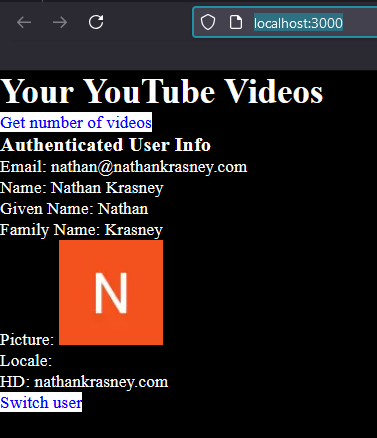
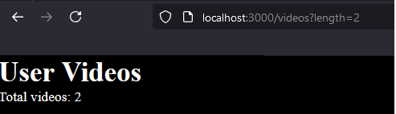

<h2>Description</h2>
  <p>
    This project extends the capabilities of accessing and managing YouTube API operations using Next.js Pages Router. By leveraging:
    <ul>
      <li>OAuth2 for secure authentication</li>
      <li>iron-session for robust session management</li>
      <li>refresh token generation to maintain continuous access</li>
    </ul>
    you won't have to re-login each time you need to be authenticated by the Google authentication server.
  </p>

<h2>Motivation</h2>
  <p>
    I have implemented access to the YouTube API from the server using OAuth2 - check the third item in <a href='#references'>References</a>. Now, I want to add the client side using Next.js.
  </p>

<h2>Demo</h2>
  The following represent the pages UI

  <h3>Home Page</h3>
  <p>
    In this figure, you can see the buttons for 'Switch user' - used to log in the user to Google using OAuth2, and 'Get number of videos' - used to retrieve the number of videos on the YouTube channel compatible with the logged-in Google account.
  </p>
  

  <h3>Videos Page</h3>
  <p>
    In this figure, you can see the number of videos that the logged-in user (nathan@nathankrasney.com) has on their YouTube channel.
  </p>
  

<h2>Installation</h2>
Invoke the following to install all packages:

```bash
pnpm i 
```
You can also use npm

<h2>Usage</h2>
  <p>
    Run the development server using:
    <pre><code>npm run dev</code></pre>
    Follow these instructions:
    <ol>
      <li>From the index page, choose "Get videos" to see the number of videos.</li>
      <li>From the index page, choose "Switch user" to log in to Google as another Google account. The supported accounts are nathan@nathankrasney.com and natankrasney@gmail.com, which are defined as test users in my Google Cloud project. You need to create your own to make this code work.</li>
    </ol>
  </p>

<h2>Design</h2>
  <ul>
    <li><strong>Architecture</strong>: Similar to the third item in <a href='#references'>References</a> but improved.</li>
    <li><strong>Framework</strong>: Using Next.js, starting from the client.</li>
    <li><strong>APIs</strong>:
      <ul>
        <li><code>/api/auth/authlogin</code>: Initiates the authentication process - login to Google</li>
        <li><code>/api/auth/oauth2callback</code>: Called by /api/auth/authlogin with code </li>
        <li><code>/api/auth/refresh-token</code>: Automatically requests a new access token when the access token one hour is expired </li>
        <li><code>/api/videos</code>: Standalone API for video-related operations</li>
      </ul>
    </li>
    <li><strong>Session Management</strong>: Using <code>iron-session</code> to store encrypted cookies <code>accessToken</code> and <code>refreshToken</code> (valid for one week, configurable). The <code>accessToken</code> is valid for one hour, allowing usage without re-login.</li>
    <li><strong>Middleware</strong>: Using <code>withAuth</code> middleware to handle authentication, so APIs like <code>videos</code> handle only video-related operations.</li>
    <li><strong>Token Refresh</strong>: Added a <code>refresh-token</code> endpoint to automatically request a new access token when the current one expires.</li>
    <li><strong>Video Count</strong>: Passes video count back to the page, different from the third item in <a href='#references'>References</a>.</li>
  </ul>

<h2>Code</h2>
The following are selected code snippets

<h3>Login</h3>
To login a user to google you do in /api/auth/authlogin

```ts
const authUrl = oauth2Client.generateAuthUrl({
    access_type: "offline",
    scope: SCOPES,
  });
  res.redirect(authUrl);
```

<h3>Logout</h3>
  <p>The user info (<code>accessToken</code>, <code>refreshToken</code>, and <code>userInfo</code>) is stored in an iron-session session, which is essentially a cookie. So, if you don't want the current user to keep making Google API operations, you simply destroy the cookie:</p>


```ts
function logout(session: IronSession<IronSessionData>){
  session.destroy(); // --- this is actually logout , start from scratch
}
```
This is called on <code>/api/auth/oauth2callback</code>


<h2>Credentials</h2>
    These must be kept privately
    <p>Same as in the third item in <a href='#references'>Refernces</a>, but here add <code>IRON_SESSION_PASSWORD</code> and put inside a next.js file <code>.env.local</code> with:</p>
    <ul>
        <li><code>GOOGLE_CLIENT_ID</code></li>
        <li><code>GOOGLE_CLIENT_SECRET</code></li>
        <li><code>NEXT_PUBLIC_YOUTUBE_REDIRECT_URI</code></li>
    </ul>


<h2>Scopes</h2>
These scopes MUST be set in the google cloud project on top of the code here

```ts
const SCOPES = [
    "https://www.googleapis.com/auth/youtube.readonly", // -- require to get video list
    "https://www.googleapis.com/auth/userinfo.profile", // -- require to get user profile
    "https://www.googleapis.com/auth/userinfo.email"    // -- require to get user email
  ];
```

<h2>Points of interest</h2>
<ul>
<li>While login is actually access Google authentication server , logout is handle by simply destroying the cookie where the access token and refresh token are stored</li>
</ul>


<h2 id='references'>References</h2>
<ol>
<li><a href = 'https://youtu.be/FeWPqNC18ho?si=uKvrel6E0dYXoeAq'>Unlocking Cookies: The Secret Behind Web Sessions  </a></li>
<li><a href = 'https://www.youtube.com/watch?v=xuQJMZBb4AM'>  Secure Session Management with Iron-Session!  </a></li>
<li><a href='https://youtu.be/xrvYzZe_YC4'>Managing YouTube Channel Data with Google API and OAuth2 : A POC Guide</a></li>
</ol>